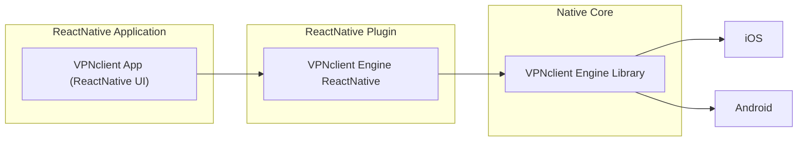

# VPNclient App (React-Native Implementation)

A cross-platform, open-source VPN client with support for multiple protocols (Xray, WireGuard, OpenVPN) and advanced routing capabilities.

## 🌟 Key Features

### Core Functionality
- **Multi-Protocol Support**: VMess, VLESS, Reality (Xray), WireGuard, OpenVPN
- **Cross-Platform**: iOS, Android
- **Subscription Management**: Import server lists via URL
- **Advanced Routing**: Split tunneling, domain rules, app-level routing

### Security
- Kill Switch protection
- Auto-connect on startup
- No root/jailbreak required

### Performance
- Real-time connection stats
- Server latency testing
- Optimized native engine

## 📦 Architecture Overview



**Technology Stack**:
- **Frontend**: React Native, TypeScript
- **State**: Zustand/Redux Toolkit
- **Styling**: Restyle/NativeWind
- **Testing**: Jest, Detox
- **CI/CD**: GitHub Actions, Fastlane

---
## 🧱 Архитектура React Native приложения

### 1. **Архитектурный стиль**

* **Modular Monorepo** (если Web и Mobile): используйте **Turborepo** или **Nx** — легко переиспользовать логику и UI между web/mobile.
* **Clean Architecture**: делите код на слои `presentation` / `application` / `domain` / `infrastructure`.

### 2. **Навигация**

* `@react-navigation/native` с **bottom-tabs + stack-nesting** (типично для e-commerce).
* Deep Linking + Universal Links (важно для маркетинга и пушей).

### 3. **Состояние**

* `Zustand` или `Redux Toolkit` с RTK Query (удобно для кеширования API).
* Не забывайте про **react-query** / `TanStack Query`, если делаете акцент на data fetching.

### 4. **UI-компоненты**

* **Atomic Design** подход — делите компоненты на `Atoms`, `Molecules`, `Organisms`.
* Используйте `Restyle` или `NativeWind` для стилизации.

### 5. **Работа с API**

* REST-first, GraphQL только если бэкенд готов его поддерживать.
* Автоматическая генерация типов через Swagger / OpenAPI.

---

## 🧪 Процессы разработки

### 1. **CI/CD**

* GitHub Actions или GitLab CI.
* Автоматическая сборка на TestFlight и Google Play Internal (через EAS от Expo или fastlane).

### 2. **Code Quality**

* ESLint + Prettier + Husky + Lint-Staged.
* Строгая типизация (TypeScript).
* Codegen типов из API (Swagger / GraphQL).

### 3. **Тестирование**

* **Unit**: `Jest`, `Testing Library`.
* **E2E**: `Detox` (для React Native).
* Вводите покрытие критического UI и flows (логин, корзина, checkout).

### 4. **Процессы**

* Kanban/Agile + weekly sprint planning.
* Внедрите CI/CD и Feature Flags (например, с `LaunchDarkly` или `ConfigCat`) для гибких релизов.

---

## 🚀 Getting Started

### For End Users
Download from official stores:
- [Google Play](https://play.google.com/store/apps/details?id=click.vpnclient)
- [App Store (TestFlight)](https://testflight.apple.com/join/KQr4SeS7)

### For Developers
```bash
# Clone repository
git clone https://github.com/VPNclient/VPNclient-react-native-app.git
cd VPNclient-react-native-app

# Install dependencies
yarn install

# Run on iOS/Android
yarn ios
yarn android
```

**Platform Requirements**:
- Android 6.0+
- iOS 15.6+
- Node.js 18+


## 📬 Support

- [GitHub Issues](https://github.com/VPNclient/VPNclient-app/issues)
- [Telegram Group](https://t.me/vpnclient_chat)
- Email: support@vpnclient.click

---

> Part of the **VPNclient Ecosystem**:
> - [Engine Core](https://github.com/VPNclient/VPNclient-engine)
> - [React Native Plugin](https://github.com/VPNclient/VPNclient-engine-react-native)

