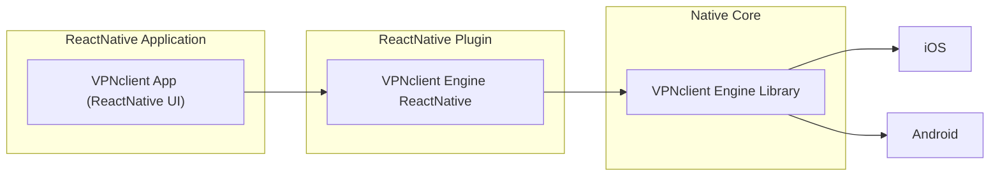

# VPNclient App (React-Native Implementation)

A cross-platform, open-source VPN client with support for multiple protocols (Xray, WireGuard, OpenVPN) and advanced routing capabilities.

## 🌟 Key Features

### Core Functionality
- **Multi-Protocol Support**: VMess, VLESS, Reality (Xray), WireGuard, OpenVPN
- **Cross-Platform**: iOS, Android, Windows, macOS, Linux
- **Subscription Management**: Import server lists via URL
- **Advanced Routing**: Split tunneling, domain rules, app-level routing

### Security
- Kill Switch protection
- Auto-connect on startup
- No root/jailbreak required

### Performance
- Real-time connection stats
- Server latency testing
- Optimized native engine

## 📦 Architecture Overview



**Technology Stack**:
- **Frontend**: React Native, TypeScript
- **State**: Zustand/Redux Toolkit
- **Styling**: Restyle/NativeWind
- **Testing**: Jest, Detox
- **CI/CD**: GitHub Actions, Fastlane

## 🚀 Getting Started

### For End Users
Download from official stores:
- [Google Play](https://play.google.com/store/apps/details?id=click.vpnclient)
- [App Store (TestFlight)](https://testflight.apple.com/join/KQr4SeS7)

### For Developers
```bash
# Clone repository
git clone https://github.com/VPNclient/VPNclient-react-native-app.git
cd VPNclient-react-native-app

# Install dependencies
yarn install

# Run on iOS/Android
yarn ios
yarn android
```

**Platform Requirements**:
- Android 6.0+
- iOS 15.6+
- Node.js 18+


## 📬 Support

- [GitHub Issues](https://github.com/VPNclient/VPNclient-app/issues)
- [Telegram Group](https://t.me/vpnclient_chat)
- Email: support@vpnclient.click

---

> Part of the **VPNclient Ecosystem**:
> - [Engine Core](https://github.com/VPNclient/VPNclient-engine)
> - [React Native Plugin](https://github.com/VPNclient/VPNclient-engine-react-native)

